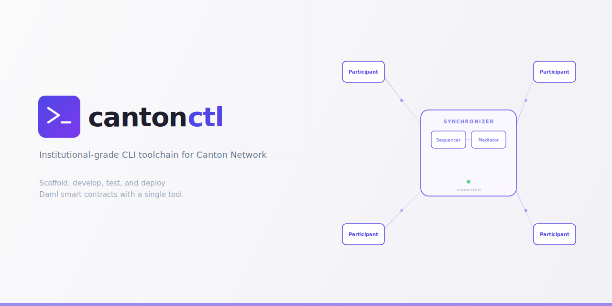

<picture>
  <source media="(prefers-color-scheme: dark)" srcset="assets/banner-dark.svg">
  <source media="(prefers-color-scheme: light)" srcset="assets/banner.svg">
  
</picture>

`cantonctl` is the Splice-aware orchestration companion and project-local control plane for teams moving the same project across sandbox, official LocalNet, and validator-backed Canton/Splice environments.

It exists because the official tools are authoritative inside their own lanes, but no single official tool owns the project-local orchestration and day-2 operations layer across local and remote environments. It wraps, not replaces, DPM, Daml Studio, Quickstart, and the official SDKs.

The current `main` branch packages as [`cantonctl@0.3.6`](https://www.npmjs.com/package/cantonctl), and this README describes that released surface.

## What It Is Not

- Not the canonical build, test, codegen, sandbox, or studio tool. Use DPM first.
- Not the canonical IDE. Use Daml Studio first.
- Not the official reference app or LocalNet launcher. Use CN Quickstart first.
- Not the primary wallet-provider or exchange toolkit. Use the official Wallet SDK and wallet integration guidance first.
- Not the default UX for unstable internal APIs.

## Start With Official Tooling

| Tool | Official role | Where `cantonctl` adds value |
|---|---|---|
| DPM | Build, test, codegen, sandbox, Studio launch | Profiles, auth, compatibility checks, diagnostics, remote-environment helpers |
| Daml Studio | Canonical Daml IDE in VS Code | Keep the canonical IDE workflow; use `cantonctl` around profiles, readiness, and diagnostics |
| CN Quickstart | Official reference app and LocalNet launchpad | Profile-driven movement from LocalNet into remote validator-backed environments |
| dApp SDK / dApp API / Wallet Gateway | Canonical wallet-connected dApp path, including CIP-0103 flows | Exported config, stable/public canaries, profile-aware diagnostics |
| Wallet SDK | Canonical wallet-provider, exchange, and custody toolkit | Config export and support-oriented readiness checks |
| Stable/public Splice APIs | Supported remote automation surfaces | Profile synthesis, discovery, validation, and CI-friendly wrappers |

See [docs/README.md](docs/README.md) for the full ecosystem-fit guide.
See [docs/CURRENT_STATE.md](docs/CURRENT_STATE.md) for the canonical live feature snapshot.
See [docs/BEST_PRACTICES.md](docs/BEST_PRACTICES.md) for the repo docs policy.

## Prerequisites

### Required

| Dependency | Version | Purpose |
|---|---|---|
| Node.js | >= 18 | Run `cantonctl` |
| DPM | Current supported Canton release | Canonical build, test, sandbox, and Studio workflow |
| Java | 21 | Required by the Daml SDK and Canton |

### Optional

| Dependency | Purpose |
|---|---|
| Docker | `dev --net` and `localnet` workflows |
| Official Splice LocalNet workspace | `localnet up/down/status` wrapper |

Verify the environment with:

```bash
npm install -g cantonctl
cantonctl doctor
```

## Quick Start

### Build with the official stack

```bash
curl -fsSL https://get.digitalasset.com/install/install.sh | sh
dpm studio
```

### Choose the right starting point

Use CN Quickstart when you want the official reference app and LocalNet launchpad:

```bash
cantonctl localnet up --workspace ../quickstart --profile sv
cantonctl localnet status --workspace ../quickstart --json
```

Use `cantonctl init` when you want a companion-ready starter with profiles, diagnostics, and stable/public Splice wiring:

```bash
cantonctl init my-app --template splice-dapp-sdk
cd my-app
cantonctl dev
cantonctl build
cantonctl test
cantonctl profiles list
cantonctl compat check splice-devnet
```

## Profiles And Environments

The default progression is:

1. `sandbox` for local contract iteration
2. `canton-multi` when you need a Canton-only multi-node topology
3. `splice-localnet` when you want to wrap the official Splice LocalNet workspace
4. `remote-validator` or `remote-sv-network` for validator-backed or SV/Scan-backed remote environments

The profile model is the product backbone. It is what lets `cantonctl` own the project-local control plane around official runtimes without re-owning the official runtime stack itself.

Today that control-plane boundary is implemented as profile resolution, LocalNet wrapping, readiness/diagnostics/discovery, the profile-first deploy rollout command, promotion rollout planning/live gates, and the current upgrade/reset rollout workflows. Diagnostics bundles now carry runtime inventory, drift, and last-operation support artifacts, but `cantonctl` still does not replace upstream runtime implementations or cloud provisioning.

## Commands

| Command | Description | Positioning |
|---|---|---|
| `cantonctl init [name]` | Scaffold a companion-ready project or starter template | Supports official-stack workflows |
| `cantonctl dev` | Start the local sandbox wrapper with hot reload | Delegates to DPM/daml |
| `cantonctl dev --net` | Start the Canton-only multi-node Docker topology | Canton-only local realism |
| `cantonctl localnet up/down/status` | Wrap the official Splice LocalNet workspace | Quickstart-aware wrapper |
| `cantonctl build` | Compile Daml and optionally codegen bindings | Delegates to DPM/daml |
| `cantonctl test` | Run Daml Script tests with structured output | Delegates to DPM/daml |
| `cantonctl deploy [target] [--profile <name>]` | Roll out a built DAR to the resolved profile or legacy target | Profile-first DAR rollout over official runtime endpoints |
| `cantonctl status` | Show profile-aware service health and ledger status | Support and diagnostics surface |
| `cantonctl diagnostics bundle` | Export a support-friendly diagnostics bundle with inventory, drift, and last-operation artifacts | Support and diagnostics surface |
| `cantonctl profiles list/show/validate` | Inspect and validate resolved runtime profiles | Current control-plane foundation |
| `cantonctl profiles import-scan` | Synthesize profile blocks from stable/public scan discovery | Stable/public discovery helper |
| `cantonctl profiles import-localnet` | Materialize a `splice-localnet` profile from an official LocalNet workspace | LocalNet-to-profile bootstrap |
| `cantonctl compat check [profile]` | Check stable/public compatibility for a profile | Stable/public guardrail |
| `cantonctl operator validator licenses --profile <name>` | List approved validator licenses through the explicit operator Scan surface | Explicit operator namespace |
| `cantonctl preflight --profile <name>` | Run the read-only profile rollout gate | Current inspection step in rollout flows |
| `cantonctl readiness --profile <name>` | Run the composed readiness gate for a resolved profile | JSON-first gate reused by promotion workflows |
| `cantonctl promote diff --from <a> --to <b>` | Plan or execute a profile-to-profile promotion rollout | Promotion plan, dry-run, and apply surface |
| `cantonctl upgrade check --profile <name>` | Plan or execute an upgrade workflow for a resolved profile | Manual-only for remote targets; supported apply for LocalNet workspace cycling |
| `cantonctl reset checklist --network <tier>` | Plan or execute a reset workflow for a network tier or resolved profile | Advisory for network tiers; supported apply for LocalNet workspace cycling |
| `cantonctl auth login/logout/status` | Manage profile-oriented app and operator credentials | Remote environment helper |
| `cantonctl discover network --scan-url <url>` | Discover network metadata from stable/public scan surfaces | Stable/public discovery helper |
| `cantonctl canary stable-public` | Run stable/public remote canaries | CI and promotion gate |
| `cantonctl export sdk-config` | Export resolved config for official SDK consumers | SDK wiring helper |
| `cantonctl scan updates/acs/current-state` | Query stable/public Scan surfaces | Stable/public only |
| `cantonctl token holdings/transfer` | Use stable holdings and transfer-factory flows | Stable/public only |
| `cantonctl ans list/create` | Read or create ANS entries through stable/public flows | Stable/public only |
| `cantonctl validator traffic-buy/traffic-status` | Use stable validator-user traffic flows | Stable/public only |
| `cantonctl codegen sync` | Sync manifest-managed upstream specs and generated clients | Maintainer workflow |
| `cantonctl doctor` | Check prerequisites and profile-aware environment readiness | Support and diagnostics surface |
| `cantonctl topology show/export` | Preview or export the local Canton-only topology | Local topology builder |

All public commands support `--json`.

## Stable/Public Vs Experimental

### Stable/Public Defaults

- Profile-based config and compatibility checks
- LocalNet-to-profile bootstrap via `profiles import-localnet`
- Official LocalNet wrapping via `localnet up/down/status`
- Scan, token-standard, ANS, and validator-user surfaces
- Auth, status, readiness, preflight, and doctor flows for sandbox, LocalNet, and remote profiles
- Manifest-driven stability policy and generated client sync

### Explicitly Experimental

- Scan-proxy-only reads
- Any validator-internal, wallet-internal, or other operator-only surface

### Explicit Operator Namespace

- `operator validator licenses` is the current approved operator-mode command
- it depends on `splice-scan-external-openapi` with stability `stable-external`
- unsupported validator-internal, wallet-internal, and scan-proxy admin surfaces remain outside the CLI until they are explicitly approved

See [docs/reference/api-stability.md](docs/reference/api-stability.md).

## Templates And Examples

Stable/public Splice workflows lead the starter story:

```bash
cantonctl init my-app --template splice-dapp-sdk
cantonctl init my-app --template splice-scan-reader
cantonctl init my-app --template splice-token-app
```

If you want the official reference app path, start from Quickstart instead of these templates.

Examples:

- [docs/examples/README.md](docs/examples/README.md)
- [docs/examples/splice-dapp-sdk.md](docs/examples/splice-dapp-sdk.md)
- [docs/examples/splice-scan-reader.md](docs/examples/splice-scan-reader.md)
- [docs/examples/splice-token-app.md](docs/examples/splice-token-app.md)

## Docs

- [docs/README.md](docs/README.md)
- [docs/concepts/ecosystem-fit.md](docs/concepts/ecosystem-fit.md)
- [docs/concepts/when-to-use-which-tool.md](docs/concepts/when-to-use-which-tool.md)
- [docs/concepts/target-users.md](docs/concepts/target-users.md)
- [docs/concepts/non-goals.md](docs/concepts/non-goals.md)
- [docs/reference/configuration.md](docs/reference/configuration.md)
- [docs/reference/profiles.md](docs/reference/profiles.md)
- [docs/reference/topology.md](docs/reference/topology.md)
- [docs/reference/localnet.md](docs/reference/localnet.md)
- [docs/reference/compatibility.md](docs/reference/compatibility.md)
- [docs/reference/operator.md](docs/reference/operator.md)
- [docs/reference/deploy.md](docs/reference/deploy.md)
- [docs/reference/preflight.md](docs/reference/preflight.md)
- [docs/reference/promotion.md](docs/reference/promotion.md)
- [docs/reference/upgrade.md](docs/reference/upgrade.md)
- [docs/reference/reset.md](docs/reference/reset.md)
- [docs/reference/diagnostics.md](docs/reference/diagnostics.md)
- [docs/reference/discovery.md](docs/reference/discovery.md)
- [docs/reference/canary.md](docs/reference/canary.md)
- [docs/reference/sdk-config-export.md](docs/reference/sdk-config-export.md)
- [docs/tasks/ci-gates.md](docs/tasks/ci-gates.md)

## Release And Migration Notes

- [docs/release-notes/](docs/release-notes/)
- [docs/migration/](docs/migration/)

Command-scope, boundary, and terminology changes belong in those directories when they are user-visible.
